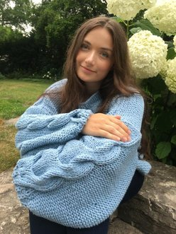

# GIMIK
### A simple CAD software

## Big Ideas and Highlights

## What is GIMIK?
GIMIK is a simple CAD software that allows the user to create, remove, scale, and move geometric shapes. It features a GUI and automatically-scaling axes, along with highlighting selected objects for an improved user experience. GIMIK's input fields are robust against improper input, the software can handle numerous shapes, and the software can natively save an image of the current workspace.

## Setup and Installation
Our program requires Python to be installed. If it is not already installed, we recommend doing so using Anaconda. The installation instructions can be found on the [Anaconda Documentation website](https://docs.anaconda.com/anaconda/install/).

Alternatively, you could follow [these instructions](https://realpython.com/installing-python/#how-to-install-python-on-linux).

We are using libraries built into Python to create the program, so no other installation is required.

### Python Packages
For the program to run, make sure you have the following python packages:
- tkinter
- numpy
- matlotlib 
- abc 

These should be automatically installed with Python. However, if you do not have these already, run the following command in your command line:
`pip install [package name]` replacing [package name] with whichever package you are missing. Note that this requires pip to be installed for the corresponding version of Python. 

### Usage
To run the GIMIK program on your machine, navigate to our [github repository](https://github.com/olincollege/gimik) and clone the repository to your local machine. Navigate to the gimik folder and run the following command in your terminal: 
`python main.py`

This will open the GIMIK window and you are ready to start CADing! 

## Using GIMIK

### Initializing the Program
To initialize GIMIK, navigate to the folder GIMIK is stored in, and run the command `python main.py` in the terminal. A GIMIK window should appear!

## How to Use GIMIK

### Using buttons
To use any of the buttons on the left side of the view, simply click on them. To use any of the moving or scaling options, first enter the desired value into the box to the left of the button, then click the button. Clicking the button multiple times will cause the same effect to happen several times, and you'll have to right or left click on the view space to refresh the figure to show your changes.

### Saving a Screenshot of the Canvas
To save a screenshot of your beautiful creation, simply click the "save" icon below the view space. A popup will open asking where you want to save your image, clicking "Save" once you've navigated to the correct directory will save your image.

### Creating and Removing Shapes
Use the shape buttons on the left side of the screen to create your chosen shape. Currently, the program supports only cubes, spheres, and cylinders. To remove a shape, click the 'Remove Shape' button also located on the left. 

### Select Shape
If you wish to modify a specific shape, use the blue arrows on the left to select between the shapes. The selected shape turns yellow and all of the changes you make will be reflected on that shape. Remember to click on the figure to refresh it!

### Scale Shape
To scale the shape, use the entry boxes and buttons on the bottom of the window. You may scale the entire shape, or only one side. Enter an integer or a float into the entry box and press the corresponding button to scale the shape. If you enter a value that is not an integer or a float, you will receive a pop-up error. Close the pop-up and make sure that your input is a valid number and try again.

### Moving the Shapes
At the bottom of the screen, there are 3 more entry boxes dedicating to moving the center of the objects. You may move the shapes in the x, y, and z directions. To move the center of the shape, enter your chosen value ito the entry box and press the corresponding button. Note that you must enter an integer or a float, and typing an invalid input will produce the same error as the one described in the Scale Shape section. 

### Example Creation
An example creation can be seen here:

## Attribution for External Resources

### Images for Buttons
The button images were created by the following people:
- Kiranshastry on [flaticon](https://www.flaticon.com/authors/kiranshastry)
- Xinh Studio on [The Noun Project](https://thenounproject.com/xinhstudio/)
- Alessandro Bertoni on [The Noun Project](https://thenounproject.com/ilbret/)

### Image for Main Program
The image used for the window icon was created by Gustavo Zambelli whose work can be found on their [dribble page](https://dribbble.com/zamax).

## Authors

### Dasha Chadiuk
#### Olin College of Engineering '24

Dasha enjoys coding and loves the satisfaction of having a working program. Working on GIMIK has taught her a lot about user interaction and she hopes to continue exploring ways  to create the best user experience with her projects.

### Han Vakil
#### Olin College of Engineering '24

Han likes when code runs bug free, but likes the feeling of fixing an annoying bug even more. He also has a newfound appreciation for developers of larger CAD programs and the work they do.
